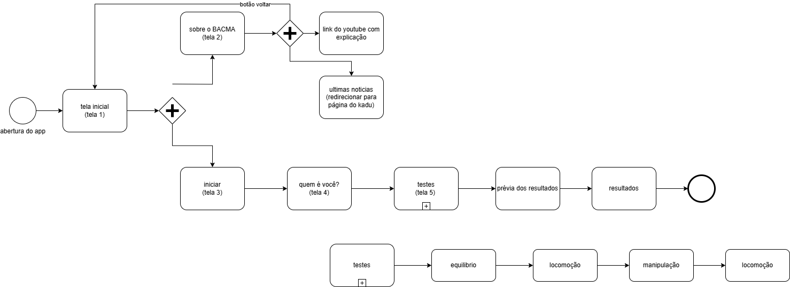

# bacma_mobile

O aplicativo de aplicação do teste BACMA é produto de uma pesquisa realizada por Carlos Eduardo Lima Monteiro, et al e pode ser acessada no [link](artigos/Criação%20e%20determinação%20da%20validade%20de%20uma%20bateria%20de%20teste%20para%20coordenação%20motora%20em%20crianças%20com%20autismo.pdf) e faz parte do trabalho de conclusão de curso de Bacharelado em Sistemas de Informação da UNIRIO

## Fluxo de telas do app

